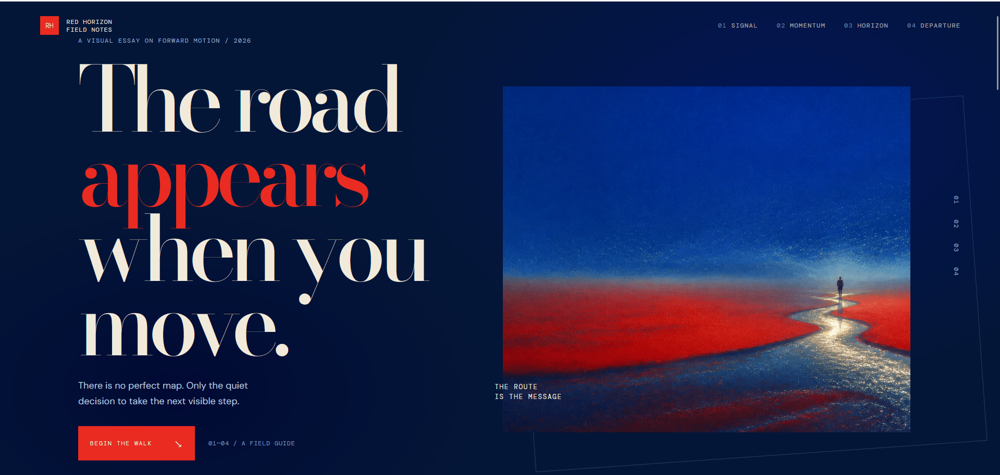

# Red Horizon

A cinematic, editorial scrollytelling web essay exploring forward motion, creative momentum, and intuitive direction. Built with React, GSAP ScrollTrigger, Lenis smooth scrolling, and an archival visual design system.



---

## Overview

Red Horizon is an interactive digital essay presented as a sequence of field notes across four distinct narrative chapters. Rather than a conventional webpage, it functions as an audiovisual and typographic installation designed to be experienced chronologically through scroll interaction.

The experience synthesizes contemporary digital art direction, high-fashion publication aesthetics, and precise physics-driven motion choreography.

---

## Design Taste and Aesthetic Philosophy

### 1. Minimalist Haute Editorial
The art direction draws inspiration from printed editorial journals, architecture monographs, and experimental typography. The visual language favors intentional whitespace, sharp typographic contrast, and restrained ornamentation, allowing copy and imagery to command focus.

### 2. Physicality and Grain
To counteract digital flatness, a custom fractal noise texture overlay is applied across the canvas. Combined with archival paper tones and unrounded layout containers, this introduces a tactile, printed-matter quality reminiscent of a physical field journal.

### 3. Atmospheric Immersion and Dynamic Continua
The environment shifts dynamically as the reader navigates through space. Background colorways transition between deep nocturnal blues, high-energy vermilion, and warm archival cream, reflecting the emotional arc of each chapter.

---

## Design Elements and System Architecture

### Typographic Hierarchy
The typographic system creates an interplay between classical elegance, editorial drama, and technical precision:

- **Editorial Display (`Bodoni Moda`):** High-contrast modern serif with extreme vertical stress, razor-sharp hairline serifs, and negative letter-spacing for headlines and chapter markers.
- **Technical Telemetry (`DM Mono`):** Fixed-width monospace type used for coordinates, chapter indicators, timestamps, micro-metadata, buttons, and section kickers.
- **Narrative Body (`DM Sans`):** Clean, geometric humanist sans-serif providing high legibility across descriptive prose.
- **Display Accent (`Oswald`):** Condensed uppercase sans-serif utilized for structured metric grids and principle headers.

### Color Palette and Chromatic Strategy
The color architecture relies on high-contrast shifts and deliberate emotional associations:

| Token | Hex Value | Role and Intent |
|---|---|---|
| Deep Midnight | `#041638` | Primary ground tone; nocturnal depth and contemplative space |
| Indigo Blue | `#08245f` | Secondary atmospheric fill for oceanic continuity |
| Vermilion Red | `#e92b21` | Narrative thread, active signal, and high-impact momentum chapter |
| Archival Parchment | `#f1eadb` | Warm cream ground tone providing editorial tactile contrast |
| Telemetry Slate | `#93add8` | Low-luminosity text for auxiliary metadata and coordinates |

### Motion Choreography and Animation Principles

- **Synchronized Inertial Scrolling:** Powered by Lenis and bound directly into the GSAP ticker, providing consistent scroll physics across varied input devices without lag.
- **Masked Word-Level Typography Reveals:** Headlines are split into wrapped span masks that cascade vertically with power-curve easing upon entering the viewport.
- **Differential Parallax:** Narrative copy, figures, and ambient backdrops drift across differing speed ratios to generate true physical depth.
- **Image Clip-Path Expansion:** Visual plates enter via dynamic inset clip-path transitions that unmask into full view as the reader scrolls.
- **Global Route Line Tracker:** A persistent top-level progress bar scrubs continuously across the entire scroll envelope from start to completion.
- **Adaptive Dual Navigation:** A fixed top header bar paired with a vertical right-hand coordinate rail that reflects active viewport chapter state via IntersectionObserver.

---

## Narrative Structure

- **Chapter 00: Arrival** — Establishing coordinates (`33° 41′ S / 18° 25′ E`) and the central thesis: "The road appears when you move."
- **Chapter 01: Signal** — The initial intuitive pull; subtle light on an undefined path.
- **Chapter 02: Momentum** — Full vermilion saturation; three foundational principles on embracing uncertainty and action.
- **Chapter 03: Horizon** — Inverted parchment aesthetic; the widening perspective gained through movement.
- **Chapter 04: Departure** — Convergence of red and blue; dispatch registration for future field notes.

---

## Technical Stack

- **Framework:** React 18
- **Build Tool:** Vite
- **Animation Engine:** GSAP 3 (ScrollTrigger)
- **Smooth Scroll:** Lenis
- **Styling:** Custom CSS with CSS variables, fluid clamp typography, and CSS Grid
- **Accessibility:** Semantic HTML landmarks, keyboard navigation support, and full `prefers-reduced-motion` compliance

---

## Getting Started

### Prerequisites
- Node.js (v18 or higher recommended)
- npm, pnpm, or yarn

### Installation

1. Clone the repository:
   ```bash
   git clone https://github.com/Mudassar-Khann/red-horizon.git
   ```

2. Navigate to the project directory:
   ```bash
   cd red-horizon
   ```

3. Install dependencies:
   ```bash
   npm install
   ```

4. Start the local development server:
   ```bash
   npm run dev
   ```

5. Build for production:
   ```bash
   npm run build
   ```

6. Preview the production build:
   ```bash
   npm run preview
   ```

---

## Project Structure

```
red-horizon/
├── index.html              # HTML entrypoint with metadata and root mount
├── package.json            # Project dependencies and script definitions
├── public/
│   └── images/             # Visual art plates, chapter photography, and preview GIF
├── src/
│   ├── main.jsx            # Application root, narrative content, and GSAP timeline bindings
│   ├── styles.css          # Global typography imports and foundational utility styles
│   └── overrides.css       # Red Horizon editorial design system and responsive grid rules
└── vite.config.js          # Vite configuration
```

---

## License

This project is open source and available under the MIT License.
